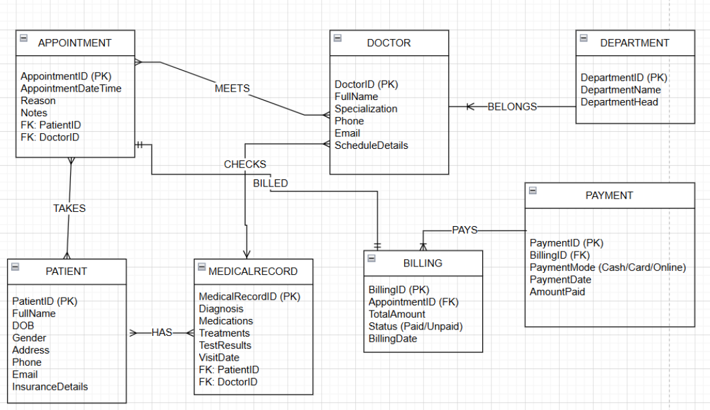

# Experiment 1: Entity-Relationship (ER) Diagram

## 🎯 Objective:
To understand and apply the concepts of ER modeling by creating an ER diagram for a real-world application.

## 📚 Purpose:
The purpose of this workshop is to gain hands-on experience in designing ER diagrams that visually represent the structure of a database including entities, relationships, attributes, and constraints.

---

## 🧪 Choose One Scenario:

### 🔹 Scenario 1: University Database
Design a database to manage students, instructors, programs, courses, and student enrollments. Include prerequisites for courses.

**User Requirements:**
- Academic programs grouped under departments.
- Students have admission number, name, DOB, contact info.
- Instructors with staff number, contact info, etc.
- Courses have number, name, credits.
- Track course enrollments by students and enrollment date.
- Add support for prerequisites (some courses require others).

---

### 🔹 Scenario 2: Hospital Database
Design a database for patient management, appointments, medical records, and billing.

**User Requirements:**
- Patient details including contact and insurance.
- Doctors and their departments, contact info, specialization.
- Appointments with reason, time, patient-doctor link.
- Medical records with treatments, diagnosis, test results.
- Billing and payment details for each appointment.

---

## 📝 Tasks:
1. Identify entities, relationships, and attributes.
2. Draw the ER diagram using any tool (draw.io, dbdiagram.io, hand-drawn and scanned).
3. Include:
   - Cardinality & participation constraints
   - Prerequisites for University OR Billing for Hospital
4. Explain:
   - Why you chose the entities and relationships.
   - How you modeled prerequisites or billing.

# ER Diagram Submission - Student Name
## Scenario Chosen:
Hospital 
## ER Diagram:

## Entities and Attributes:
## Patient
- PatientID (PK)

- FullName

- DOB

- Gender

- Address

- Phone

- Email

- InsuranceDetails

## Doctor
- DoctorID (PK)

- FullName

- Specialization

- Phone

- Email

- ScheduleDetails

## Department
- DepartmentID (PK)

- DepartmentName

- DepartmentHead

## Appointment
- AppointmentID (PK)

- AppointmentDateTime

- Reason

- Notes

- FK: PatientID

- FK: DoctorID

## MedicalRecord
- MedicalRecordID (PK)

- Diagnosis

- Medications

- Treatments

- TestResults

- VisitDate

- FK: PatientID

- FK: DoctorID

## Billing
- BillingID (PK)

- AppointmentID (FK)

- TotalAmount

- Status (Paid/Unpaid)

- BillingDate

## Payment
- PaymentID (PK)

- BillingID (FK)

- PaymentMode (Cash/Card/Online)

- PaymentDate

- AmountPaid
## Relationships and Constraints:
### Relationships
- Department — Doctor: 1 to Many

- Doctor — Appointment — Patient: Many to Many (via Appointment)

- Patient — MedicalRecord — Doctor: Many to Many

- Appointment — Billing: 1 to 1

- Billing — Payment: 1 to Many (Installments possible)

### Cardinality & Constraints
- Every Appointment is between 1 Doctor and 1 Patient.

- A Billing record is created per appointment.

- A Payment may be split into multiple records.

## Extension (Prerequisite / Billing):
### Extension: Billing and Payment
### New Entity: Bill
- Attributes: BillID (PK), DateIssued, TotalAmount, Status (e.g., Paid/Unpaid), PaymentMethod

- Relationship: Generates between Appointment and Bill

- One appointment generates one bill, so it’s a 1:1 relationship.
### Optional Extension:
- Add a Payment entity if tracking partial payments or transactions is needed.

- Attributes: PaymentID, AmountPaid, DatePaid, PaymentMethod

- Relationship: One Bill → Many Payments (1:N)

### Design Justification:
- Keeping Bill as a separate entity allows tracking financial data without overloading the Appointment entity.

- Makes it flexible to manage payments, receipts, and outstanding dues.

## Design Choices:
### Entity Choices and Justifications
### Patient
- Chosen to represent individuals receiving care.

- Attributes like PatientID, Name, DOB, and InsuranceDetails are critical for identity, communication, and billing.

### Doctor
- Represents healthcare providers.

- DoctorID, Specialization, and WorkSchedule support patient assignment, filtering, and appointments.

### Department
- Provides organizational structure (e.g., Cardiology).

- Allows grouping doctors under departments and supports departmental management.

### Appointment
- Captures interaction between a patient and doctor.

- It’s a many-to-many relationship (a patient may meet many doctors, and doctors consult many patients), resolved as an entity with AppointmentID, DateTime, etc.

### MedicalRecord
- Tracks clinical data (diagnosis, medications, test results).

- Linked to both Patient and Doctor to preserve accountability and medical history.

### Bill
- Introduced to track financial transactions.

- Associated with Appointment since billing is usually appointment-based.

- Supports attributes such as TotalAmount, PaymentMethod, and Status.

### Payment
- Represents actual financial transaction(s) against a bill.

- Allows multiple payments per bill (e.g., installments, partial payments).

- Attributes: PaymentID, BillID, PaymentDate, AmountPaid, PaymentMethod.

## Relationship Choices and Assumptions
### Patient – Appointment – Doctor
- Modeled via the Appointment entity to capture the many-to-many relationship.

- Includes attributes like ReasonForVisit, Date, and Time.

- A patient can have multiple appointments with different doctors.

### Doctor – Department
- A department can have many doctors (1:N).

- Each doctor is assigned to one department.

### MedicalRecord – Patient & Doctor
- MedicalRecord is created for each appointment, linking a specific patient and doctor.

- Relationship: N:1 for both patient and doctor sides.

- Captures diagnoses, prescriptions, and treatments.

### Appointment – Bill
- Every appointment results in exactly one bill (1:1).

- The Bill entity stores total charges and billing status for the services provided.

### Bill – Payment
- Each bill can be settled through one or more payments (1:N).

- The Payment entity includes attributes like AmountPaid, PaymentDate, and PaymentMethod.

- Supports partial payments, insurance co-pays, or installments.

## Key Assumptions
- Every patient visit must have a corresponding appointment.

- A bill is always generated for an appointment (even if free, for record-keeping).

- Medical records are visit-based, not cumulative.

- Payment tracking (e.g., partial payments, refunds) can be optionally extended by adding a Payment entity.

## RESULT
Successfully designed an ER diagram for the Hospital Database with entities, relationships, constraints, and billing-extension using the Payment entity to support real-world healthcare operations.