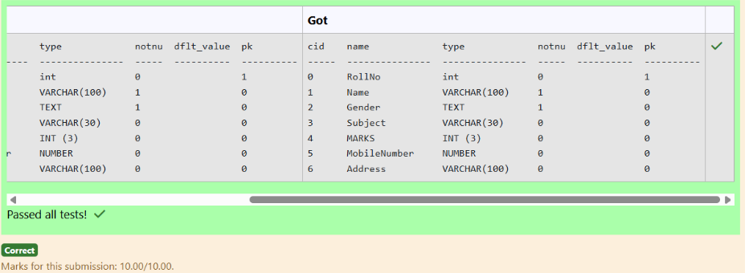
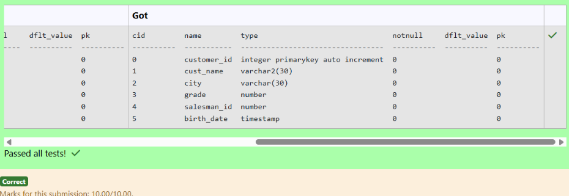

# Experiment 2: DDL Commands

## AIM
To study and implement DDL commands and different types of constraints.

## THEORY

### 1. CREATE
Used to create a new relation (table).

**Syntax:**
```sql
CREATE TABLE (
  field_1 data_type(size),
  field_2 data_type(size),
  ...
);
```
### 2. ALTER
Used to add, modify, drop, or rename fields in an existing relation.
(a) ADD
```sql
ALTER TABLE std ADD (Address CHAR(10));
```
(b) MODIFY
```sql
ALTER TABLE relation_name MODIFY (field_1 new_data_type(size));
```
(c) DROP
```sql
ALTER TABLE relation_name DROP COLUMN field_name;
```
(d) RENAME
```sql
ALTER TABLE relation_name RENAME COLUMN old_field_name TO new_field_name;
```
### 3. DROP TABLE
Used to permanently delete the structure and data of a table.
```sql
DROP TABLE relation_name;
```
### 4. RENAME
Used to rename an existing database object.
```sql
RENAME TABLE old_relation_name TO new_relation_name;
```
### CONSTRAINTS
Constraints are used to specify rules for the data in a table. If there is any violation between the constraint and the data action, the action is aborted by the constraint. It can be specified when the table is created (using CREATE TABLE) or after it is created (using ALTER TABLE).
### 1. NOT NULL
When a column is defined as NOT NULL, it becomes mandatory to enter a value in that column.
Syntax:
```sql
CREATE TABLE Table_Name (
  column_name data_type(size) NOT NULL
);
```
### 2. UNIQUE
Ensures that values in a column are unique.
Syntax:
```sql
CREATE TABLE Table_Name (
  column_name data_type(size) UNIQUE
);
```
### 3. CHECK
Specifies a condition that each row must satisfy.
Syntax:
```sql
CREATE TABLE Table_Name (
  column_name data_type(size) CHECK (logical_expression)
);
```
### 4. PRIMARY KEY
Used to uniquely identify each record in a table.
Properties:
Must contain unique values.
Cannot be null.
Should contain minimal fields.
Syntax:
```sql
CREATE TABLE Table_Name (
  column_name data_type(size) PRIMARY KEY
);
```
### 5. FOREIGN KEY
Used to reference the primary key of another table.
Syntax:
```sql
CREATE TABLE Table_Name (
  column_name data_type(size),
  FOREIGN KEY (column_name) REFERENCES other_table(column)
);
```
### 6. DEFAULT
Used to insert a default value into a column if no value is specified.

Syntax:
```sql
CREATE TABLE Table_Name (
  col_name1 data_type,
  col_name2 data_type,
  col_name3 data_type DEFAULT 'default_value'
);
```

**Question 1**
--
Insert all customers from Old_customers into Customers

```sql
INSERT INTO Customers
SELECT CustomerID, Name, Address, Email
FROM Old_customers;
```

**Output:**


**Question 2**
---
Write a SQL query to add a new column MobileNumber of type NUMBER and a new column Address of type VARCHAR(100) to the Student_details table.

```sql
ALTER TABLE Student_details
ADD COLUMN MobileNumber NUMBER;
ALTER TABLE Student_details
ADD COLUMN Address VARCHAR(100);
```

**Output:**


**Question 3**
---
Create a table named Invoices with the following constraints: InvoiceID as INTEGER should be the primary key. InvoiceDate as DATE. Amount as REAL should be greater than 0. DueDate as DATE should be greater than the InvoiceDate. OrderID as INTEGER should be a foreign key referencing Orders(OrderID). For example:

Test INSERT INTO Orders (OrderID, OrderDate, CustomerID) VALUES (1, '2024-08-01', 1); INSERT INTO Invoices (InvoiceID, InvoiceDate, Amount, DueDate, OrderID) VALUES (1, '2024-08-01', 100.0, '2024-09-01', 1); SELECT * FROM Invoices; Result InvoiceID InvoiceDate Amount DueDate OrderID

```sql
CREATE TABLE Invoices(
InvoiceID INTEGER PRIMARY KEY,
InvoiceDate DATE,
Amount REAL CHECK(Amount>0),
DueDate DATE CHECK(DueDate>InvoiceDate),
OrderID INTEGER,
foreign key (OrderID) references  Orders(OrderID));
```

**Output:**


**Question 4**
---
Create a table named Employees with the following columns:

EmployeeID as INTEGER FirstName as TEXT LastName as TEXT HireDate as DATE For example:

Test pragma table_info('Employees'); Result cid name type notnull dflt_value pk

```sql
CREATE TABLE Employees(
EmployeeID INTEGER,
FirstName TEXT,
LastName TEXT,
HireDate DATE);
```

**Output:**


**Question 5**
---
Create a table named Department with the following constraints: DepartmentID as INTEGER should be the primary key. DepartmentName as TEXT should be unique and not NULL. Location as TEXT. For example:

Test INSERT INTO Department (DepartmentID, DepartmentName, Location) VALUES (1, 'Human Resources', 'New York'); select * from Department; Result DepartmentID DepartmentName Location

```sql
CREATE TABLE Department(
DepartmentID INTEGER PRIMARY KEY,
DepartmentName TEXT UNIQUE NOT NULL,
Location TEXT);
```

**Output:**


**Question 6**
---
Write a SQL query to add birth_date attribute as timestamp (datatype) in the table customer

Sample table: customer

customer_id | cust_name | city | grade | salesman_id -------------+----------------+------------+-------+------------- 3002 | Nick Rimando | New York | 100 | 5001 3007 | Brad Davis | New York | 200 | 5001 3005 | Graham Zusi | California | 200 | 5002

For example:

Test pragma table_info('customer'); Result cid name type notnull dflt_value pk

```sql
ALTER TABLE customer
ADD COLUMN birth_date
timestamp;
```

**Output:**


**Question 7**
---
In the Student_details table, insert a student record where some fields are NULL, another record where all fields are filled without any NULL values, and a third record where some fields are filled, and others are left as NULL.

RollNo Name Gender Subject MARKS

205 Olivia Green F 207 Liam Smith M Mathematics 85 208 Sophia Johnson F Science For example:

Test select * from Student_details; Result RollNo Name Gender Subject MARKS

205 Olivia Green F 207 Liam Smith M Mathematic 85 208 Sophia Johns F Science

```sql
INSERT INTO Student_details(RollNo,Name,Gender,Subject,MARKS)
VALUES(205,'Olivia Green','F',NULL,NULL);
INSERT INTO Student_details(RollNo,Name,Gender,Subject,MARKS)
VALUES(207,'Liam Smith','M','Mathematics',85);
INSERT INTO Student_details(RollNo,Name,Gender,Subject,MARKS)
VALUES(208,'Sophia Johnson','F','Science',NULL);
```

**Output:**


**Question 8**
---
Create a table named Bonuses with the following constraints: BonusID as INTEGER should be the primary key. EmployeeID as INTEGER should be a foreign key referencing Employees(EmployeeID). BonusAmount as REAL should be greater than 0. BonusDate as DATE. Reason as TEXT should not be NULL. For example:

Test INSERT INTO Bonuses (BonusID, EmployeeID, BonusAmount, BonusDate, Reason) VALUES (1, 6, 1000.0, '2024-08-01', 'Outstanding performance'); SELECT * FROM Bonuses; Result BonusID EmployeeID BonusAmount BonusDate Reason

1 6 1000.0 2024-08-01 Outstanding performance

```sql
CREATE TABLE Bonuses(
BonusID INTEGER PRIMARY KEY,
EmployeeID INTEGER,
BonusAmount REAL CHECK(BonusAmount>0),
BonusDate DATE,
Reason TEXT NOT NULL,
foreign key (EmployeeID) references Employees(EmployeeID));
```

**Output:**


**Question 9**
---
Create a table named Shipments with the following constraints: ShipmentID as INTEGER should be the primary key. ShipmentDate as DATE. SupplierID as INTEGER should be a foreign key referencing Suppliers(SupplierID). OrderID as INTEGER should be a foreign key referencing Orders(OrderID). For example:

Test INSERT INTO Shipments (ShipmentID, ShipmentDate, SupplierID, OrderID) VALUES (2, '2024-08-03', 99, 1); Result Error: FOREIGN KEY constraint failed

```sql
CREATE TABLE Shipments(
ShipmentID INTEGER PRIMARY KEY,
ShipmentDate DATE,
SupplierID INTEGER,
OrderID INTEGER,
foreign key (SupplierID) references Suppliers(SupplierID),
foreign key (OrderID) references Orders(OrderID));
```

**Output:**


**Question 10**
---
Insert a book with ISBN 978-1234567890, Title Data Science Essentials, Author Jane Doe, Publisher TechBooks, and Year 2024 into the Books table.

For example:

Test SELECT * FROM Books; Result ISBN Title Author Publisher Year

978-1234567890 Data Science Essentials Jane Doe TechBooks 2024

```sql
INSERT INTO Books(ISBN,Title,Author,Publisher,Year)
VALUES('978-1234567890','Data Science Essentials','Jane Doe','TechBooks',2024);
```

**Output:**


## RESULT
Thus, the SQL queries to implement different types of constraints and DDL commands have been executed successfully.
